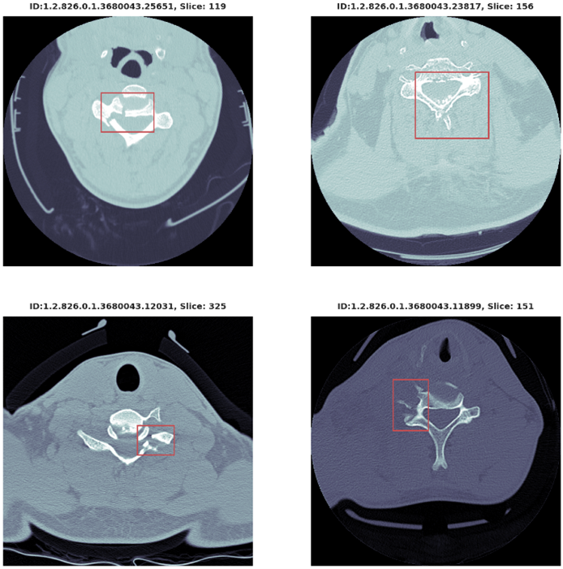

# _Literature Review: 2022 USNA Cervical Spine Fracture Detection_
## _Abstract:_
In this paper, several aspects critical to the understanding of cervical spine fracture detection are discussed. Cervical spine anatomy, medical imaging considerations, and current limitations are introduced for discussion. This paper then dives into the history of machine learning, and its use in medical diagnostics with a particular emphasis on medical imaging. Finally, current research into the implementation of both machine learning models for CT scan fracture identification is discussed – as well as the clinical viability and future development of such models, as they relate to the 2022 USNA Cervical Spine Fracture Detection competition [1]. 

## _Introduction:_
The cervical spine comprises the topmost seven vertebrae (C1 through C7) located from the base of the skull to the shoulder girdle [2]. Cervical spine injuries are considered the most severe form of spinal injuries, due to their proximity to the brain. Outcomes for cervical spine injuries can range from partial loss of sensory function to complete paralysis (tetra/quadriplegia), and even death [3]. The diagnosis of these injuries usually involves a skilled medical specialist (typically a radiologist), interpreting the results of one or more imaging modalities. 

For these specialists, the most common imaging methods for diagnostic purposes are X-Ray, Magnetic Resonance Imaging (MRI), and Computed Tomography (CT) scanning [4]. Of particular interest is CT scanning – which has many advantages over both X-Ray and MRI. Most notably, both MRI and CT can capture image “slices”, forming a topological three-dimensional view of the structures in and around the cervical spine (blood vessels, empty space, soft tissue, bone tissue, etc.), where X-Ray is relegated to a two-dimensional view of such structures. However, while CT produces less detailed images than MRI, it can output these structures in seconds, whereas MRI may take from 20 to 40 minutes [5]. In emergency medicine, this time could mean the difference between healthy recovery and any of the adverse outcomes described previously. 

In recent years, strides in machine learning algorithms have allowed physicians to leverage computational tools to help diagnose such injuries. Of particular concern is the sensitivity – the ability of a test to correctly identify patients with a condition – and specificity – the ability of a test to correctly identify patients without the condition – of these algorithms [6]. Many open-source algorithms have been developed, both independent of and in collaboration with physicians and health organizations, to help improve these and other metrics of interest and improve the speed and accuracy of diagnosis of this particularly impactful class of injury. 

## _Discussion & Analysis:_
Machine learning (ML) has a long, rich history, beginning in the early 1950s, with Arthur Samuel of IBM’s rudimentary computer program for playing checkers, which measured the chances of each side winning, and chooses the next move based on these probabilities. Since then, many others have laid the foundation for what machine learning is today – such as Frank Rosenblatt’s 1957 ‘Perceptron’, constructed for image recognition, and Marcello Pelillo’s 1967 ‘nearest neighbor’ algorithm which formed the basis of basic pattern recognition [7]. Today, many of these pioneering developers’ creations have been adapted and refined, for purposes in sectors ranging from healthcare, business, science, and even military applications.
 
While ML is nothing new, medical imaging as a clinically valuable technology has been around much longer. The first major development was Wilhelm Conrad Roentgen’s discovery of the X-Ray in 1895. These types of rays absorb based on tissue density – where fat and soft tissues are reflected less brightly in an x-ray image than bone or hard structures. This discovery started the trend toward radiography for diagnostics and continued to inspire and inform other breakthroughs. In 1967, Sir Godfrey Hounsfield invented the first CT scanner – which takes radiographic projections from multiple angles and builds a 2-D image from mathematical models. The level of anatomical detail outlined in these images was far more than could ever be achieved with X-Ray alone, and by the early 1980s – about 3 million CT studies had been performed. Presently, after many advances, over 100 million CT studies occur annually [8].  

While extremely popular, CT suffers from several weaknesses. The most glaring fault in CT is its rate of successfully identifying fractures. In one study related to pelvic and hip fractures, MRI detected fractures in 99% of patients, whereas CT identified fractures in 53% of patients [9]. This fact is further exacerbated by the fact that patients with fractures may have underlying conditions which obscure the region of interest – such as osteoporosis, or other degenerative diseases [10]. However, as discussed previously, MRI has several constraints which make it less clinically useful than CT – especially in emergency cervical spine fracture detection. Several individuals possess contraindications related to MRI imaging – namely elderly patients with implants, or medical devices that may become damaged or further injure the patient under the MRI machine’s strong magnetic field [9]. Thus, much research involving machine learning for the proper classification of fractures has been focused on improving the rate at which CT detects these fractures, given the concerns of accessibility and time constraints involving MRI detection. 

Recent strides in both ML algorithm development and CT image processing have enabled researchers to produce algorithms that aid in fracture detection. Generally, ML is used by applying a model to a structured set of data – such as a large dataset of CT images – labeled either as a positive or a negative diagnosis [11]. After ‘training’ the ML algorithm with this dataset, the algorithm becomes adept at predicting the diagnosis of fractures using different data sets. 

Salehinejad, et al. (2021) published a paper on one such deep learning model developed by their group for this very purpose [12]. Their proposed solution involved the use of a ResNet-50 [13] deep convolutional network (DCNN), trained with 990 normal, and 222 fracture cases. The images were preprocessed with three different ‘window widths’ (which provide higher contrast for a certain type of structure – ranging from soft tissue to bone) and then normalized to 384 x 384 pixels. In performance with the test dataset of 3,666 CT scans – the ResNet model showed 75.79% classification accuracy, and 79.18% classification accuracy for the imbalanced and balanced datasets, respectively. They observed a classification bias from their model leading to significant false positives, given that most CT scan diagnoses are negative for fractures. However, they were still able to assert a much higher classification accuracy than CT alone, as previously discussed. 

Much research is also being done in open-source coding communities such as Kaggle. A notebook published by Samuel Cortinhas (2022), developed a model which segmented the C1 through C7 vertebrae and trained a Random Forest Classifier to predict the incidence of spine fracture with 88% accuracy for the RSNA 2022 Cervical Spine Fracture Detection competition. As seen in the figure below, their solution produced an output of bound boxes for the Region of Interest (RoI) where the fracture is likely to be located [14]. This is already much improved from the standard classification rate using CT alone – and the open-source nature of this solution has allowed others to implement their own improvements based upon this notebook to create even more robust diagnostic tools.

Fig 1: Some examples of regions of found cervical spine fracture post-image segmentation. 

## _Conclusion:_
The potential for CT imaging to approach the sensitivity and specificity of more taxing modalities such as MRI is undeniable. Further research must be done to implement more precise spine segmentation in deep learning models for diagnosis. Likewise, correcting the biases found in these models (due to unbalanced real-world cases of fractures) would lead to fewer false positives, and more clinically valuable ML image processing. The open-source coding community will likely lead the way in designing and implementing these solutions – and the progress currently being made by individuals and teams in independent research labs, GitHub, and platforms such as Kaggle give a glimpse into a future where such tools are made available in clinical settings.

## _References:_

[1] M. Taschetta-Millane, “RSNA launches cervical spine fracture AI Challenge,” Imaging Technology News, 01-Aug-2022. [Online]. Available: https://www.itnonline.com/content/rsna-launches-cervical-spine-fracture-ai-challenge. [Accessed: 13-Sep-2022]. 
[2] “Cervical spine (neck): What it is, Anatomy & Disorders,” Cleveland Clinic. [Online]. Available: https://my.clevelandclinic.org/health/articles/22278-cervical-spine. [Accessed: 18-Sep-2022]. 
[3] “Cervical spinal cord injury: Symptoms and prognosis,” What Is a Cervical Spinal Cord Injury? | Shepherd Center. [Online]. Available: https://www.shepherd.org/patient-programs/spinal-cord-injury/levels-and-types/Cervical-Spinal-Cord-Injury. [Accessed: 18-Sep-2022]. 
[4] “Spinal Cord Injury,” Mayo Clinic, 02-Oct-2021. [Online]. Available: https://www.mayoclinic.org/diseases-conditions/spinal-cord-injury/diagnosis-treatment/drc-20377895#:~:text=MRI.,might%20compress%20the%20spinal%20cord. [Accessed: 18-Sep-2022]. 
[5] “CT scan vs. MRI: What's the difference? and how do doctors choose which imaging method to use?,” Memorial Sloan Kettering Cancer Center, 13-Jul-2022. [Online]. Available: https://www.mskcc.org/news/ct-vs-mri-what-s-difference-and-how-do-doctors-choose-which-imaging-method-use. [Accessed: 18-Sep-2022]. 
[6]  A. Swift, R. Heale, and A. Twycross, “What are sensitivity and specificity?,” Evidence-Based Nursing, 01-Jan-2020. [Online]. Available: https://ebn.bmj.com/content/23/1/2. [Accessed: 18-Sep-2022]. 
[7] K. D. Foote, “A brief history of machine learning,” DATAVERSITY, 20-Jan-2022. [Online]. Available: https://www.dataversity.net/a-brief-history-of-machine-learning/. [Accessed: 18-Sep-2022]. 
[8] E. Bercovich and M. C. Javitt, “Medical imaging: From Roentgen to the Digital Revolution, and beyond,” Rambam Maimonides medical journal, 04-Oct-2018. [Online]. Available: https://www.ncbi.nlm.nih.gov/pmc/articles/PMC6186003/. [Accessed: 18-Sep-2022]. 
[9] E. Eggenberger, G. Hildebrand, S. Vang, A. Ly, and C. Ward, “Use of CT vs. MRI for diagnosis of hip or pelvic fractures in elderly patients after low energy trauma,” The Iowa orthopaedic journal, 2019. [Online]. Available: https://www.ncbi.nlm.nih.gov/pmc/articles/PMC6604520/. [Accessed: 18-Sep-2022]. 
[10] C. Y. Chang,  D. I. Rosenthal, I. D. M. Mitchell, A. Handa, S.V. Kattapuram, and A. J. Huang, “Imaging findings of Metabolic Bone Disease,” RadioGraphics, 11-Oct-2016. [Online]. Available: https://pubs.rsna.org/doi/full/10.1148/rg.2016160004. [Accessed: 18-Sep-2022]. 
[11] B. J. Erickson, P. Korfiatis, Z. Akkus, and T. L. Kline, “Machine Learning for Medical Imaging,” RadioGraphics, 17-Feb-2017. [Online]. Available: https://pubs.rsna.org/doi/full/10.1148/rg.2017160130/. [Accessed: 18-Sep-2022]. 
[12] H. Salehinejad et al., "Deep Sequential Learning For Cervical Spine Fracture Detection On Computed Tomography Imaging," 2021 IEEE 18th International Symposium on Biomedical Imaging (ISBI), 2021, pp. 1911-1914, doi: 10.1109/ISBI48211.2021.9434126.
[13] “Deep Network designer,” ResNet-101 convolutional neural network - MATLAB. [Online]. Available: https://www.mathworks.com/help/deeplearning/ref/resnet101.html;jsessionid=1d51583cd0bd68742fc05dea6fc5. [Accessed: 18-Sep-2022]. 
[14] S. Cortinhas, “Extracting vertebrae c1, ..., C7,” Kaggle, 25-Aug-2022. [Online]. Available: https://www.kaggle.com/code/samuelcortinhas/extracting-vertebrae-c1-c7. [Accessed: 18-Sep-2022]. 
